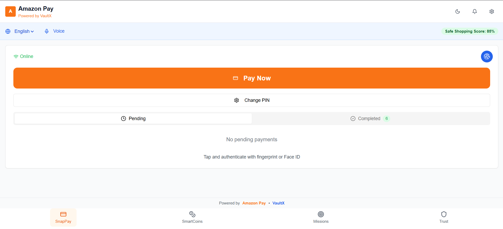
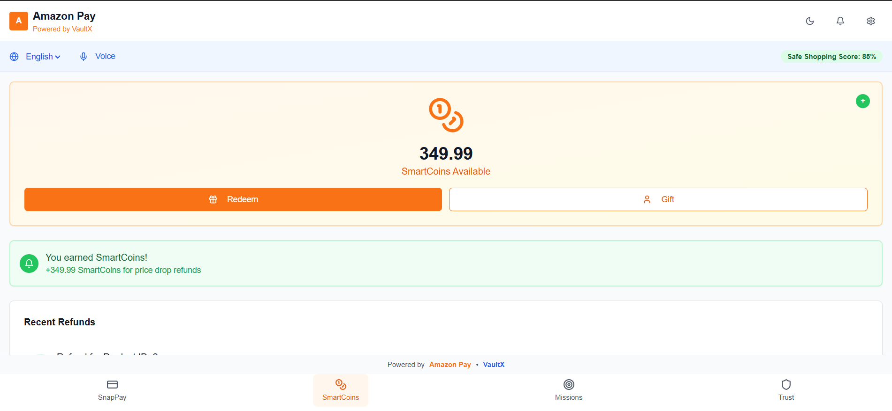
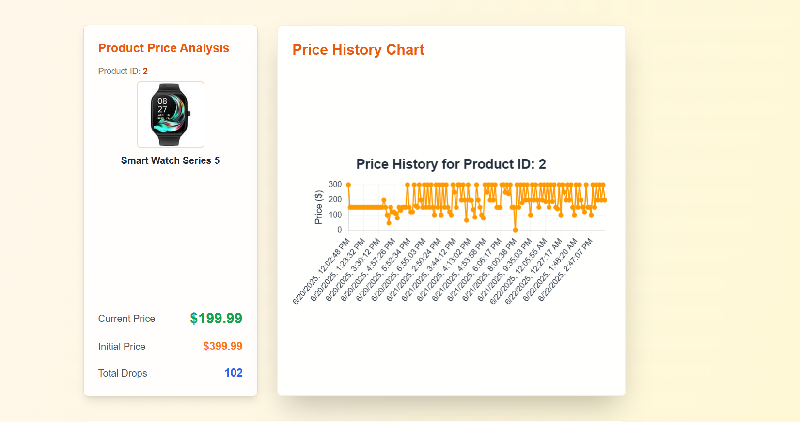
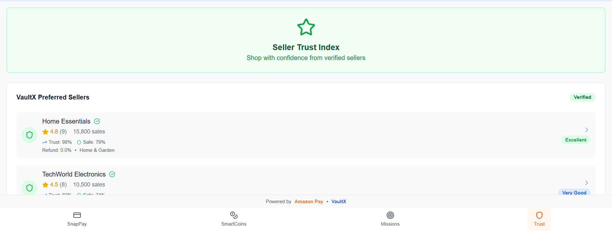

# 🏦 VaultX - Secure Payment Platform

> **Amazon HackOn Season 5 Submission**  
> A revolutionary payment platform powered by Amazon Pay with SmartCoins rewards and advanced seller trust scoring.

## 🌐 Vercel Link

**Live Demo**: [VaultX - Secure Payment Platform](https://vaultxzip.vercel.app/)


## 📋 Table of Contents

- [🚀 Overview](#-overview)
- [✨ Features](#-features)
- [🏗️ Architecture](#️-architecture)
- [🛠️ Tech Stack](#️-tech-stack)
- [📦 Installation](#-installation)
- [🔧 Configuration](#-configuration)
- [🚀 Usage](#-usage)
- [📊 API Endpoints](#-api-endpoints)
- [🎯 Key Components](#-key-components)
- [🔐 Security Features](#-security-features)
- [📱 Screenshots](#-screenshots)
- [🤝 Acknowledgments](#-Acknowledgments)


## 🚀 Overview

VaultX is a cutting-edge payment platform that combines the reliability of Amazon Pay with innovative features like SmartCoins rewards and comprehensive seller trust scoring. Built for the modern e-commerce landscape, VaultX provides a secure, user-friendly, and feature-rich payment experience.

### 🎯 Project Goals

- **Secure Payments**: Biometric authentication and PIN-based security
- **Smart Rewards**: SmartCoins system for customer loyalty
- **Trust Scoring**: Advanced seller trust and safety metrics
- **Offline-First**: Robust offline payment processing
- **Price Intelligence**: Real-time price tracking and history
- **Automated Refunds**: AWS Lambda-powered automatic refund processing

## ✨ Features

### 💳 Payment Features
- **Biometric Authentication**: Fingerprint and PIN-based security
- **Offline Processing**: Payments work without internet connection
- **Transaction Sync**: Automatic synchronization when online
- **Multi-factor Security**: PIN lockout protection and retry limits

### 🪙 SmartCoins System
- **Refund Rewards**: Earn SmartCoins from product refunds
- **Balance Tracking**: Real-time SmartCoins balance
- **Transaction History**: Complete refund and reward history
- **Price History Access**: Direct access to product price charts

### 🛡️ Trust & Safety
- **Seller Trust Scoring**: Multi-dimensional trust analysis
- **Safe Shopping Score**: Comprehensive safety metrics
- **Price Drop Tracking**: Monitor product price changes
- **Refund Rate Analysis**: Seller reliability indicators

### 📊 Analytics & Insights
- **Price History Dashboard**: Interactive price charts
- **Seller Performance**: Detailed seller analytics
- **Transaction Monitoring**: Real-time payment tracking
- **Network Status**: Connectivity monitoring

### 🤖 Automated Refund Processing
- **Price Change Detection**: AWS Lambda monitors product price changes
- **Automatic Refund Calculation**: Intelligent refund amount computation
- **Backend Integration**: Seamless refund processing through API
- **Frontend Updates**: Real-time SmartCoins balance updates
- **Transaction History**: Complete audit trail of automatic refunds

## 🏗️ Architecture

```
VaultX/
├── app/                          # Next.js App Router
│   ├── api/                      # API Routes
│   │   ├── products/             # Product management
│   │   ├── smartcoins/           # SmartCoins system
│   │   ├── seller-trust/         # Trust scoring
│   │   └── transactions/         # Payment processing
│   ├── components/               # React components
│   ├── dashboard/                # Analytics dashboard
│   ├── vaultx/                   # Main VaultX interface
│   └── auth/                     # Authentication pages
├── components/                   # Shared UI components
├── lib/                          # Utility functions
├── public/                       # Static assets
└── styles/                       # Global styles

AWS Infrastructure/
├── DynamoDB/                     # NoSQL database
│   ├── products/                 # Product data
│   ├── price_history/            # Price change tracking
│   ├── refunds/                  # Refund records
│   └── transactions/             # Payment transactions
├── Lambda Functions/             # Serverless processing
│   ├── price-change-monitor/     # Price change detection
│   ├── refund-calculator/        # Refund amount computation
│   └── smartcoins-updater/       # Balance updates
└── EventBridge/                  # Event-driven architecture
    └── price-change-events/      # Price change triggers
```

## 🛠️ Tech Stack

### Frontend
- **Next.js 15.2.4** - React framework with App Router
- **TypeScript 5.0** - Type-safe JavaScript
- **Tailwind CSS 3.4.17** - Utility-first CSS framework
- **Radix UI** - Accessible component primitives
- **Lucide React** - Beautiful icons
- **Chart.js** - Interactive charts and graphs

### Backend & Database
- **AWS DynamoDB** - NoSQL database for scalability
- **AWS Lambda** - Serverless functions for automated processing
- **AWS EventBridge** - Event-driven architecture for price changes
- **Next.js API Routes** - Serverless API endpoints
- **IndexedDB** - Client-side data storage
- **LocalStorage** - Fallback storage

### Authentication & Security
- **Biometric Auth** - Fingerprint and PIN security
- **PIN Management** - Secure PIN storage and validation
- **Offline Security** - Local data encryption

### Development Tools
- **ESLint** - Code linting
- **PostCSS** - CSS processing
- **Autoprefixer** - CSS vendor prefixing

## 📦 Installation

### Prerequisites
- Node.js 18+ 
- npm or pnpm
- AWS Account (for DynamoDB)

### Setup Instructions

1. **Clone the repository**
   ```bash
   git clone https://github.com/yourusername/Amazon-HackOn-Season-5.git
   cd Amazon-HackOn-Season-5
   ```

2. **Install dependencies**
   ```bash
   npm install
   # or
   pnpm install
   ```

3. **Environment Configuration**
   Create a `.env.local` file:
   ```env
   AWS_REGION=eu-north-1
   AWS_ACCESS_KEY_ID=your_access_key
   AWS_SECRET_ACCESS_KEY=your_secret_key
   ```

4. **Run the development server**
   ```bash
   npm run dev
   # or
   pnpm dev
   ```

5. **Open your browser**
   Navigate to [http://localhost:3000](http://localhost:3000)


## 🔧 Configuration

### AWS DynamoDB Setup

Default PIN - "123456"

1. **Create DynamoDB Tables**
   ```bash
   # Products table
   aws dynamodb create-table \
     --table-name products \
     --attribute-definitions AttributeName=id,AttributeType=N \
     --key-schema AttributeName=id,KeyType=HASH \
     --billing-mode PAY_PER_REQUEST

   # Price history table
   aws dynamodb create-table \
     --table-name price_history \
     --attribute-definitions AttributeName=id,AttributeType=S \
     --key-schema AttributeName=id,KeyType=HASH \
     --billing-mode PAY_PER_REQUEST

   # Refunds table
   aws dynamodb create-table \
     --table-name refunds \
     --attribute-definitions AttributeName=id,AttributeType=S \
     --key-schema AttributeName=id,KeyType=HASH \
     --billing-mode PAY_PER_REQUEST
   ```

2. **Configure IAM Permissions**
   Ensure your AWS credentials have DynamoDB read/write permissions.

### Seller Trust Modal
```typescript
// Comprehensive seller trust analysis
<SellerDetailModal 
  sellerId="seller_001"
  isOpen={true}
  onClose={handleClose}
/>
```

## 🚀 Usage

### For Customers

1. **Browse Products**: Visit the homepage to see featured products
2. **Make Payment**: Click "Pay Now" and authenticate with PIN
3. **Earn SmartCoins**: Get rewarded for refunds and price drops
4. **Track History**: View transaction and price history

### For Developers

1. **API Integration**: Use the RESTful API endpoints
2. **Custom Components**: Extend the UI component library
3. **Database Operations**: Work with DynamoDB tables
4. **Authentication**: Implement custom auth flows

## 📊 API Endpoints

### Products
- `GET /api/products/[id]` - Get product details
- `PATCH /api/products/[id]/price` - Update product price
- `POST /api/products/[id]/price-drop` - Process price drop
- `GET /api/products/[id]/price-history` - Get price history

### SmartCoins
- `GET /api/smartcoins?userId={id}` - Get user's SmartCoins balance

### Seller Trust
- `GET /api/seller-trust` - Get all sellers with trust scores
- `GET /api/seller-trust?sellerId={id}` - Get specific seller details

### Transactions
- `POST /api/transactions` - Process payment transactions

## 🎯 Key Components

### BiometricAuth Component
```typescript
// Secure PIN-based authentication with offline support
<BiometricAuth 
  onSuccess={handleTransactionSuccess}
  onError={handleError}
  amount={100}
  productId="123"
/>
```

### Price History Dashboard
```typescript
// Interactive price charts with real-time data
<PriceHistoryChart 
  productId="123"
  data={priceHistoryData}
/>
```

### Seller Trust Modal

## 🔐 Security Features

### Authentication
- **6-digit PIN**: Secure numeric authentication, (Default PIN : 123456)
- **Lockout Protection**: 5 failed attempts trigger 20-second lockout
- **Biometric Support**: Fingerprint authentication ready
- **Offline Security**: Local data protection

### Data Protection
- **Encrypted Storage**: Sensitive data encryption
- **Secure APIs**: Parameterized queries prevent injection
- **Network Security**: HTTPS enforcement
- **Session Management**: Secure session handling

### Privacy
- **User Anonymization**: User ID generation
- **Data Minimization**: Only necessary data collection
- **Local Processing**: Offline-first approach

## 🤖 AWS Lambda Configuration

### Automated Refund Processing Setup

1. **Create Lambda Functions**
   ```bash
   # Price Change Monitor Lambda
   aws lambda create-function \
     --function-name vaultx-price-change-monitor \
     --runtime nodejs18.x \
     --handler index.handler \
     --role arn:aws:iam::YOUR_ACCOUNT:role/lambda-execution-role \
     --zip-file fileb://price-change-monitor.zip

   # Refund Calculator Lambda
   aws lambda create-function \
     --function-name vaultx-refund-calculator \
     --runtime nodejs18.x \
     --handler index.handler \
     --role arn:aws:iam::YOUR_ACCOUNT:role/lambda-execution-role \
     --zip-file fileb://refund-calculator.zip

   # SmartCoins Updater Lambda
   aws lambda create-function \
     --function-name vaultx-smartcoins-updater \
     --runtime nodejs18.x \
     --handler index.handler \
     --role arn:aws:iam::YOUR_ACCOUNT:role/lambda-execution-role \
     --zip-file fileb://smartcoins-updater.zip
   ```

2. **Configure EventBridge Rules**
   ```bash
   # Create rule for price change events
   aws events put-rule \
     --name vaultx-price-change-rule \
     --event-pattern '{"source":["vaultx.price.change"],"detail-type":["PriceChange"]}' \
     --state ENABLED

   # Add Lambda targets
   aws events put-targets \
     --rule vaultx-price-change-rule \
     --targets Id=1,Arn=arn:aws:lambda:REGION:ACCOUNT:function:vaultx-price-change-monitor
   ```

3. **Lambda Function Workflow**
   ```typescript
   // Price Change Monitor Lambda
   export const handler = async (event: any) => {
     const { productId, oldPrice, newPrice } = event.detail;
     
     // Check if refund is applicable
     if (newPrice < oldPrice) {
       const refundAmount = oldPrice - newPrice;
       
       // Trigger refund calculation
       await lambda.invoke({
         FunctionName: 'vaultx-refund-calculator',
         Payload: JSON.stringify({ productId, refundAmount })
       });
     }
   };
   ```

4. **Environment Variables**
   ```env
   # Lambda Environment Variables
   DYNAMODB_TABLE_NAME=vaultx_refunds
   API_ENDPOINT=https://your-api.vercel.app/api
   SMARTCOINS_RATE=1.0
   ```

## 📱 Screenshots

### Main Interface


### SmartCoins Dashboard


### Price History Charts


### Seller Trust Analysis


## 🙏 Acknowledgments

- **Amazon Web Services** for DynamoDB and Lambda infrastructure
- **Next.js Team** for the amazing framework
- **Tailwind CSS** for the utility-first CSS framework
- **Radix UI** for accessible components
- **HackOn Season 5** organizers for the opportunity
- **Nikhil** for building the APIs and Backend
- **Shreelekha** for building the Face-ID Biometric and PPT
- **Mansi** for building the Seller Trust and UI and PPT

---

**Built with ❤️ for Amazon HackOn Season 5**
